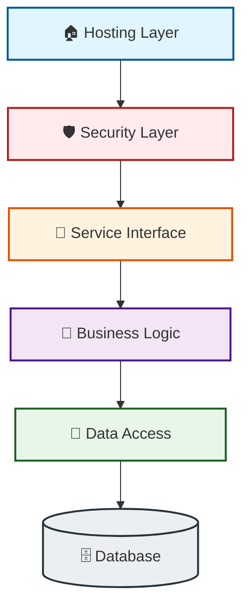
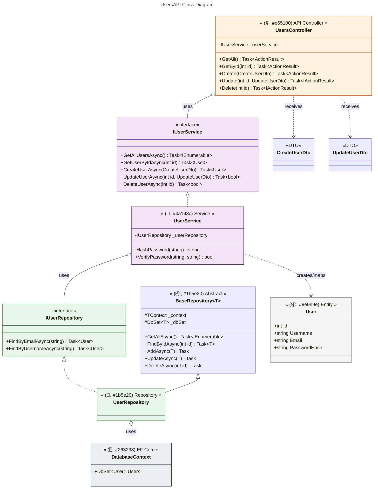

🌐 UsersAPIModern RESTful User Management Service
Author: Joseph Adogeri
Version: 1.0.0
Date: March 30, 2026
------------------------------
Description
A production-ready .NET 9 Web API designed for secure user management. This system implements industry-standard security using Argon2id password hashing, a robust Repository Pattern, and a global exception handling middleware to ensure consistent, secure, and reliable API interactions.
Authors

* Joseph Adogeri

------------------------------
📋 Table of Contents

🏗 Project Overview
🏛 Architecture

Layered Service Architecture Diagram
📁 Project Folder Structure


🔐 Security Features
🚀 Service Endpoints
💎 Technology Stack
🚀 Getting Started
🧪 Testing Suite
🔄 CI/CD Pipeline
------------------------------
🏗 Project Overview
This project provides a centralized API for user CRUD operations. It is built with a "Security-First" mindset, ensuring that sensitive data is never exposed and that the system is resilient against common attack vectors like brute-force (via Argon2id) and database race conditions.
🏛 Architecture
The system follows a strict separation of concerns, ensuring that the database logic, business rules, and HTTP transport layers remain decoupled.

| Layer | Responsibility | Components |
|---|---|---|
| 🏠 Hosting | Runtime & Dependency Injection | Program.cs, appsettings.json |
| 🛡️ Security | Hashing & Validation | Argon2id, GlobalExceptionHandler |
| 📡 Service Interface | Controller Layer (REST) | UsersController |
| 🧠 Business Logic | Validation & User Services | UserService |
| 💾 Data Access | Repository & Entity Framework | UserRepository, BaseRepository |
| 🗄️ Database | Persistence | SQL Server / InMemory |

Layered Service Architecture Diagram





📁 Project Folder Structure

```
UsersAPI/
├── 📂 .github/
│   └── 📂 workflows/           # 🔄 CI/CD Pipeline (GitHub Actions)
├── 📂 UsersAPI/                # 🏠 Hosting Layer (Web API)
│   ├── 📂 Controllers/         # 📡 Service Interface (REST Endpoints)
│   ├── 📂 Data/                # 💾 Data Access Layer (EF Core Context)
│   ├── 📂 Models/              # 📦 Data Structures
│   │   ├── 📂 DTOs/            # 📩 Data Transfer Objects (Input/Output)
│   │   └── 📂 Entities/        # 🗄️ Database Domain Models
│   ├── 📂 Repositories/        # 🛠️ Repository Pattern (Base & User)
│   ├── 📂 Services/            # 🧠 Business Logic & Argon2id Hashing
│   ├── 📜 appsettings.json     # ⚙️ Configuration & Connection Strings
│   └── 📜 Program.cs           # 🚀 Entry Point & Dependency Injection
├── 📂 UsersAPI.Tests/          # 🧪 Testing Suite (NUnit)
│   ├── 📂 Controllers/         # 🚦 Integration Tests (WebApplicationFactory)
│   ├── 📂 Repositories/        # 💾 Persistence Tests (InMemory DB)
│   └── 📂 Services/            # 🧠 Logic & Security Tests (Moq)
├── 📜 .gitignore               # 🛑 Git Exclusion Rules
├── 📜 UsersAPI.slnx           # 💎 Modern Solution File
└── 📜 README.md                # 📖 Project Documentation
```
------------------------------
🔐 Security Features

   1. Argon2id Hashing: Uses Konscious.Security.Cryptography to provide memory-hard, side-channel resistant password hashing.
   2. Salt Generation: Cryptographically secure 16-byte unique salts per user.
   3. Global Exception Handling: Uses IExceptionHandler to intercept errors and return standardized ProblemDetails (RFC 7807) without leaking stack traces.
   4. Data Isolation: Uses DTOs (CreateUserDto, UpdateUserDto) to ensure internal entities and password hashes are never returned in API responses.

------------------------------
🚀 Service Endpoints

| Method | Endpoint | Description |
|---|---|---|
| GET | /api/users | Retrieve all users |
| GET | /api/users/{id} | Retrieve a specific user by ID |
| POST | /api/users | Register a new user |
| PUT | /api/users/{id} | Update user profile |
| DELETE | /api/users/{id} | Remove a user |

------------------------------
💎 Technology Stack

* Runtime: .NET 9.0 (supporting .slnx solution format)
* Database: Entity Framework Core (SQL Server / InMemory)
* Cryptography: Argon2id
* Testing: NUnit, Moq, WebApplicationFactory
* CI/CD: GitHub Actions

------------------------------
🚀 Getting StartedPrerequisites

* .NET 9 SDK
* Visual Studio 2022 (v17.13+) or VS Code

Installation

   1. Clone the repository:
   
   git clone https://github.com
   
   2. Restore & Build:
   
   dotnet restore UsersAPI.slnx
   dotnet build UsersAPI.slnx
   
   3. Run the API:
   
   dotnet run --project UsersAPI/UsersAPI.csproj
   
   
------------------------------
🧪 Testing Suite
The project includes a comprehensive suite of 90+ tests (at least 30 per layer) divided into three categories:

* Happy Path: Standard successful operations.
* Edge Case: Handling empty strings, large IDs, and boundary values.
* Exception Case: Verifying conflict handling (duplicate emails) and database failures.

Run tests via CLI:

dotnet test UsersAPI.Tests/UsersAPI.Tests.csproj

------------------------------
🔄 CI/CD Pipeline
The project uses GitHub Actions to automate the build and test cycle.

* Trigger: Every push or PR to main.
* Environment: Ubuntu Linux using .NET 9 SDK.
* Steps: Checkout -> Setup .NET -> Restore -> Build -> Test.

Would you like me to add a "Project Folder Structure" section with a tree view of your files?

